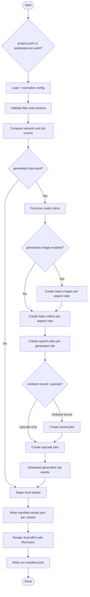

# Pipeline Diagram

## Flow Overview



## Job Count Formula

```text
image_jobs     = aspect_ratios if generated clips exist and generation.image.enabled else 0
base_jobs      = aspect_ratios if generated clips exist else 0
reference_jobs = reference_clips x aspect_ratios
speech_jobs    = narrated_generated_or_reference_clips x aspect_ratios
sound_jobs     = generated_or_reference_clips x aspect_ratios if ambientSound else 0
upscale_jobs   = generated_or_reference_clips x aspect_ratios if upscale else 0
total_jobs     = image_jobs + base_jobs + reference_jobs + speech_jobs + sound_jobs + upscale_jobs
```
