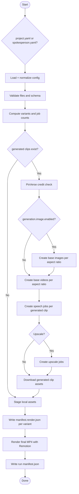

# Pipeline Diagram

## Flow Overview


```mermaid
flowchart TD
    Start([Start]) --> InputCheck{"project.yaml or spokesperson.yaml?"}
    InputCheck --> Normalize[Load + normalize config]
    Normalize --> Validate[Validate files and schema]
    Validate --> Plan[Compute variants and job counts]
    Plan --> Credit{"generated clips exist?"}
    Credit -->|No| Stage[Stage local assets]
    Credit -->|Yes| CreditCheck[PixVerse credit check]
    CreditCheck --> BaseImage{"generation.image.enabled?"}
    BaseImage -->|Yes| CreateImage[Create base images per aspect ratio]
    BaseImage -->|No| Base[Create base videos per aspect ratio]
    CreateImage --> Base
    Base --> Speech[Create speech jobs per generated clip]
    Speech --> Post{Upscale?}
    Post -->|Yes| Upscale[Create upscale jobs]
    Post -->|No| Download[Download generated clip assets]
    Upscale --> Download[Download generated clip assets]
    Download --> Stage
    Stage --> RenderManifest[Write manifest.render.json per variant]
    RenderManifest --> Render[Render final MP4 with Remotion]
    Render --> RunManifest[Write run manifest.json]
    RunManifest --> Done([Done])
```

## Job Count Formula

```text
image_jobs     = aspect_ratios if generated clips exist and generation.image.enabled else 0
base_jobs      = aspect_ratios if generated clips exist else 0
reference_jobs = reference_clips x aspect_ratios
speech_jobs    = narrated_generated_or_reference_clips x aspect_ratios
audio_jobs     = base_jobs + reference_jobs if generateAudio else 0 (no separate task)
sound_jobs     = 0 (`create sound` was removed from recent PixVerse CLI)
upscale_jobs   = generated_or_reference_clips x aspect_ratios if upscale else 0
total_jobs     = image_jobs + base_jobs + reference_jobs + speech_jobs + sound_jobs + upscale_jobs
```
